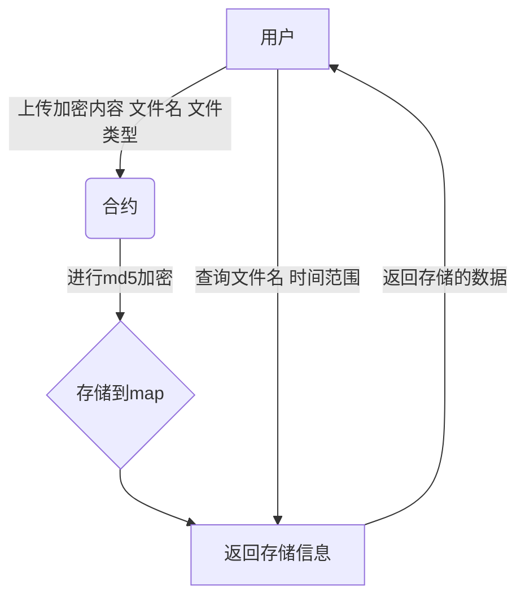
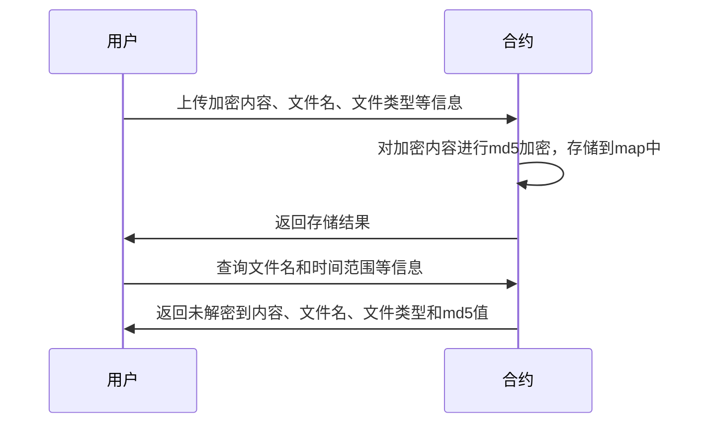
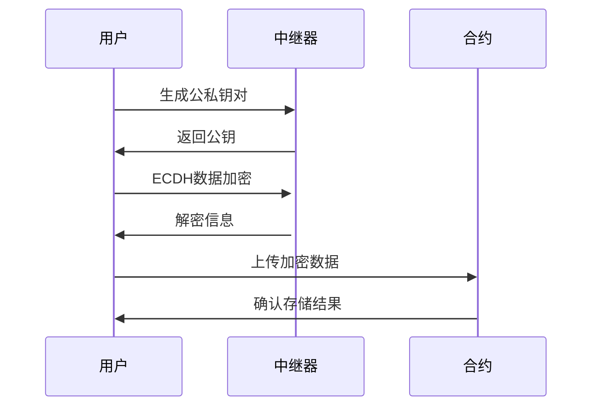
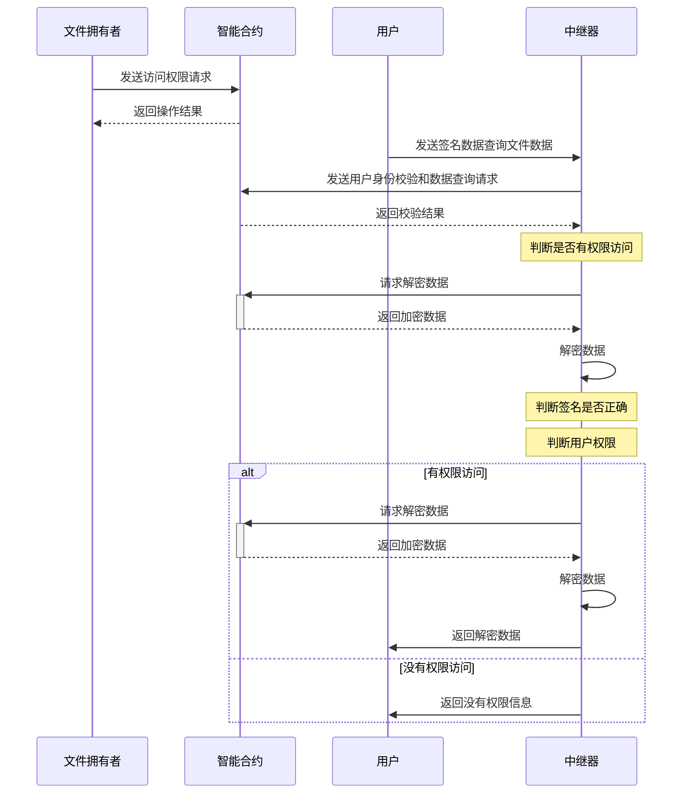
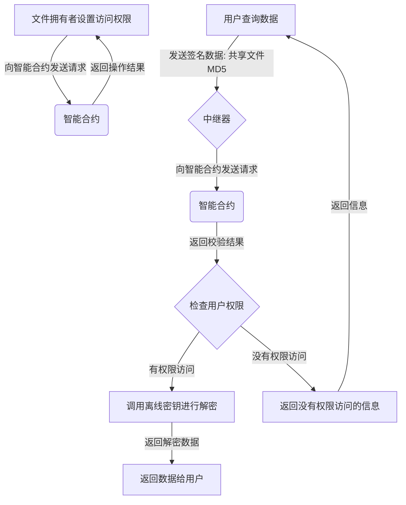

# 合约存储文件时序图

## 整体流程

- 用户通过上传加密内容、文件名、文件类型等信息向智能合约发起请求。
- 智能合约在接收到请求后，对加密内容进行md5加密，并将文件名、文件类型、加密内容和md5值存储到map中。
- 智能合约将存储结果返回给用户。
- 在用户需要查询文件时，他可以提供文件名和时间范围等信息，然后智能合约搜索map中的信息并返回未解密到内容、文件名、文件类型和md5值。

- **流程图*·*

- **时序图**

## 加密过程

- 用户调用中继器生成公私钥对。
- 中继器返回公钥给用户。
- 用户使用中继器返回的公钥和自己本身私钥进行ECDH数据加密。
- 中继器解密加密信息并将结果发送回用户。
- 用户将加密后的数据上传到智能合约进行存储。
- 智能合约确认存储结果并将结果发送回用户。

## 文件共享

文件数据已经加密存储在合约中，如何将加密存储的文件进行数据共享?

### 共享文件合约操作

1. 文件拥有者向智能合约中发送可以访问文件的的用户权限、可以访问的用户和访问时间范围的设置。
2. 智能合约收到请求后进行处理，并将操作结果返回给文件拥有者。
3. 用户向中继器发送签名数据进行查询文件数据。
4. 中继器向智能合约进行用户身份校验和数据查询。
5. 智能合约判断将校验结果数据返回给中继器。
6. 中继器根据智能合约结果判断权限，如果有，则调用本地离线的数据库离线密钥进行解密并返回解密数据给用户；否则返回没有权限访问的信息。

- **时序图**

- **流程图**

