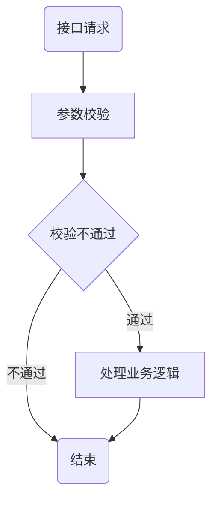
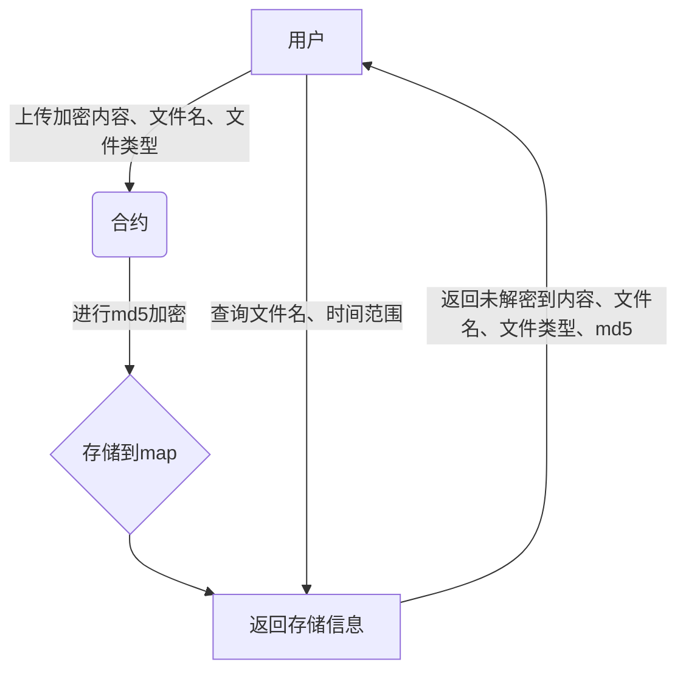

# 合约存储文件时序图

- 用户通过上传加密内容、文件名、文件类型等信息向智能合约发起请求。
- 智能合约在接收到请求后，对加密内容进行md5加密，并将文件名、文件类型、加密内容和md5值存储到map中。
- 智能合约将存储结果返回给用户。
- 在用户需要查询文件时，他可以提供文件名和时间范围等信息，然后智能合约搜索map中的信息并返回未解密到内容、文件名、文件类型和md5值。

```mermaid
graph TB
    A(接口请求) --> B[参数校验]
    B[参数校验] --> C{校验通过?}
    C{校验通过?} -- 通过 --> d[处理业务逻辑]
    C{校验不通过} -- 不通过 --> e[结束]
    d[处理业务逻辑] --> e(结束)
```

```mermaid
graph TD;
    A[用户] -->|上传加密内容、文件名、文件类型| B(合约)
    B -->|进行md5加密| C{存储到map}
    C --> D[返回存储信息]
    A -->|查询文件名、时间范围| D 
    D -->|返回未解密到内容、文件名、文件类型、md5| A
```

