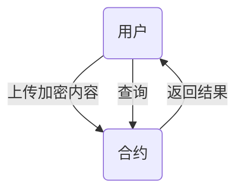
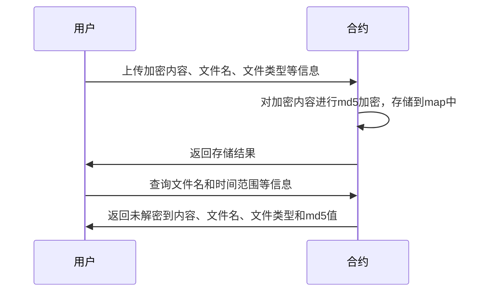
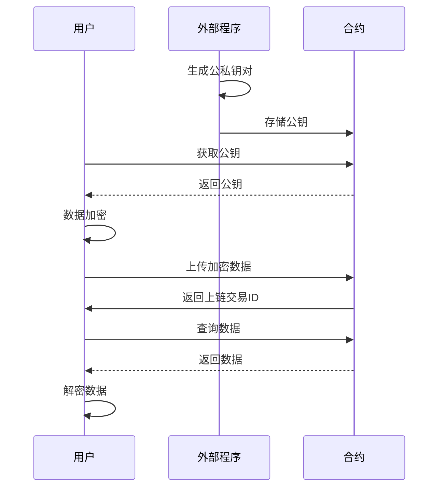
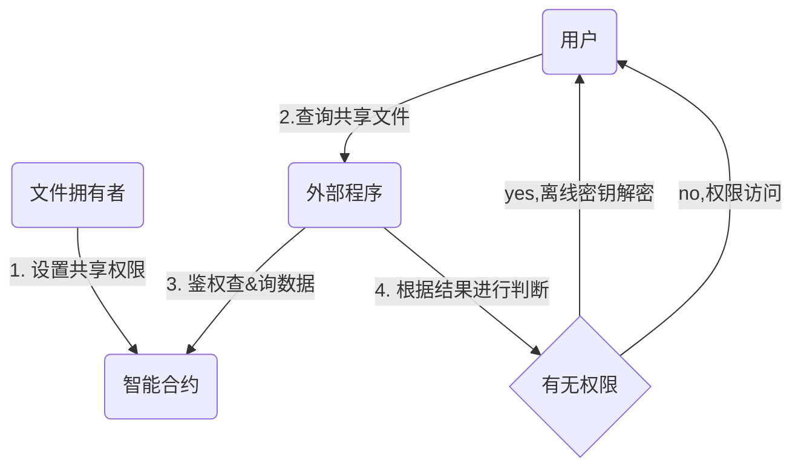
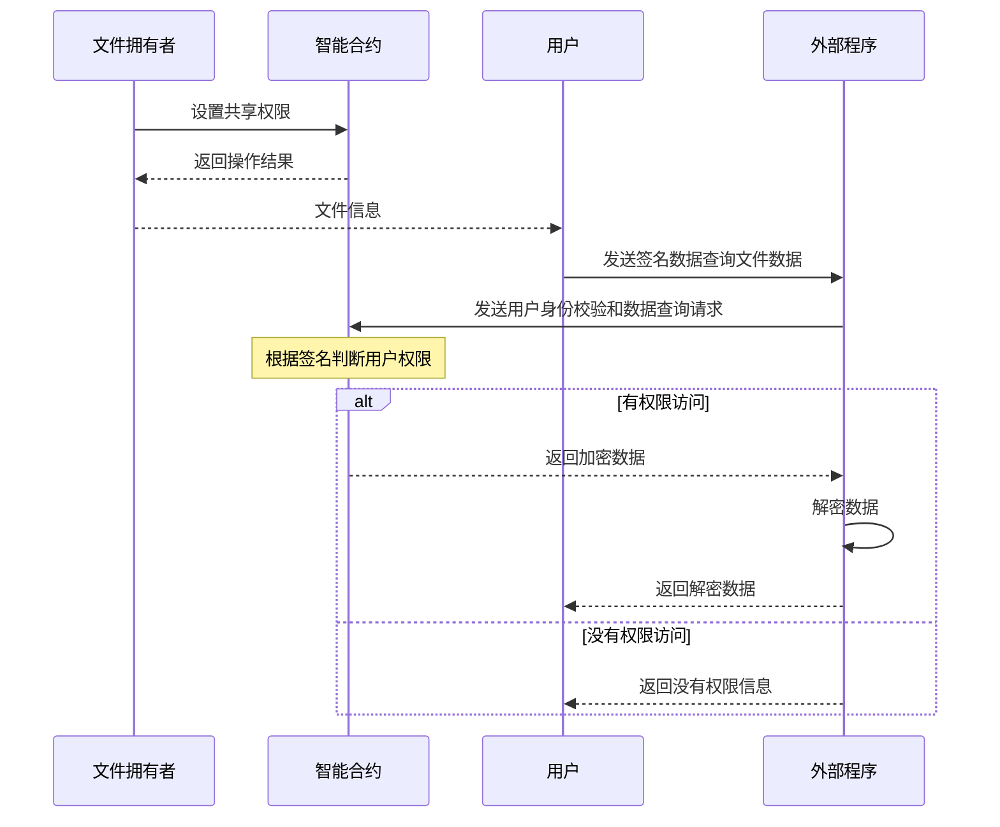

# 合约存、取、共享

为什么使用外部程序进行解密和存储用户的另一份私钥？

1. 私钥存储支持: Solidity 从一开始就不支持将私钥存储在合约中。
2. 隐私性: 在以太坊平台上，智能合约的存储状态是公开的，即所有人都可以查看合约中存储的数据，包括私钥。如果将私钥存储在合约中，那么任何人都可以窃取私钥并获取与该私钥相关的资产或权限，从而导致严重安全问题。

## 整体流程

- 用户通过上传加密内容、文件名、文件类型等信息向智能合约发起请求。
- 智能合约在接收到请求后，对加密内容进行md5加密，并将文件名、文件类型、加密内容和md5值存储到map中。
- 智能合约将存储结果返回给用户。
- 在用户需要查询文件时，他可以提供文件名和时间范围等信息，然后智能合约搜索map中的信息并返回未解密到内容、文件名、文件类型和md5值。

- **流程图**

- **时序图**

## ECDH加密存储简单过程

- 用户调用外部程序生成公私钥对。
- 外部程序返回公钥给用户。
- 用户使用外部程序返回的公钥和自己本身私钥进行ECDH数据加密。
- 外部程序解密加密信息并将结果发送回用户。
- 用户将加密后的数据上传到智能合约进行存储。
- 智能合约确认存储结果并将结果发送回用户。

## 文件共享

文件数据已经加密存储在合约中，如何将加密存储的文件进行数据共享?

### 共享条件

1. 鉴权: 指定一部分人/全部人 可见
2. 时间限制: 只在指定时间内开放
3. 安全：用户私钥不能暴露
4. 审查：当需要强制进行配合调查时可以提供解密

### 共享文件合约操作

1. 文件拥有者向智能合约中进行访问文件的的用户和允许时间范围的设置。
2. 智能合约收到请求后进行处理，并将操作结果返回给文件拥有者。
3. 用户向外部程序发送签名数据进行查询文件数据。
4. 外部程序向智能合约进行用户身份校验和数据查询。
5. 智能合约判断将校验结果数据返回给外部程序。
6. 外部程序根据智能合约结果判断权限，如果有，则调用本地离线的数据库离线密钥进行解密并返回解密数据给用户；否则返回没有权限访问的信息。

- **流程图**

- **时序图**

